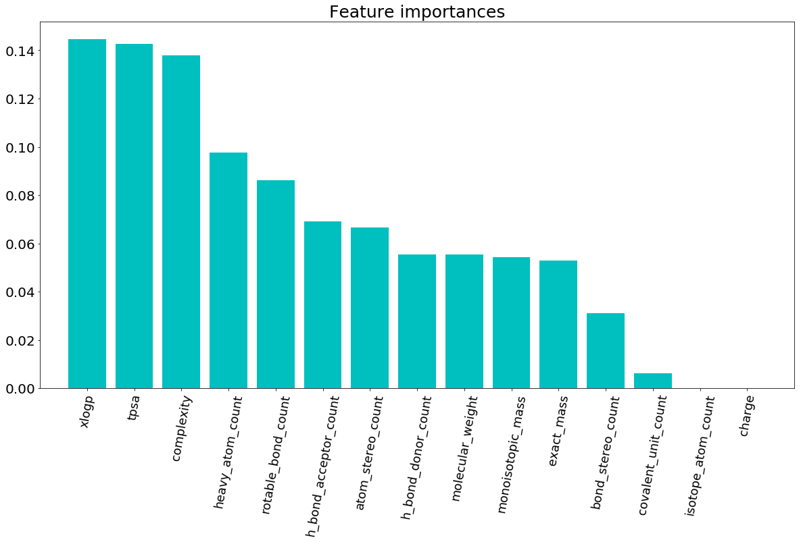
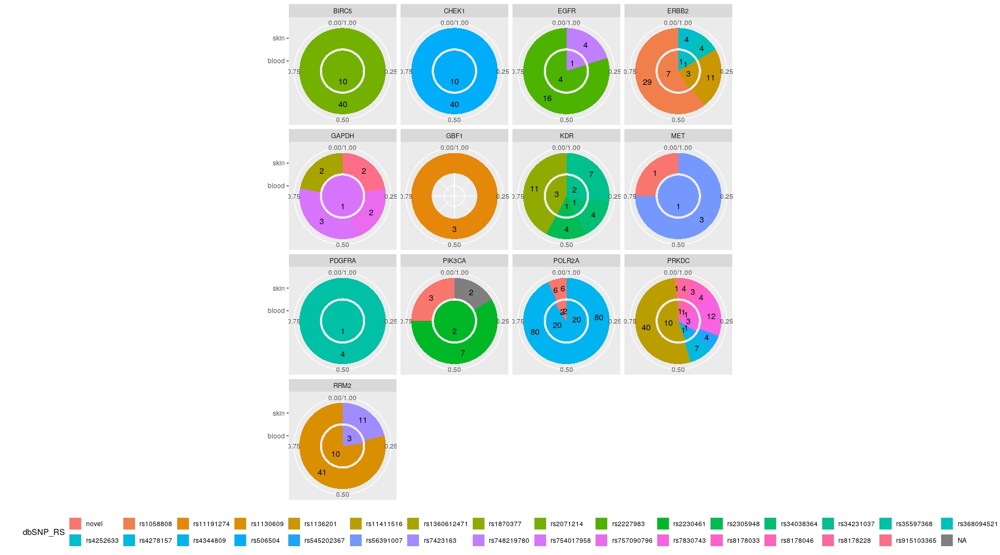

##### Contents
|
<a href="https://github.com/SVAI/teamone#Abstract">Abstract</a> | 
<a href="https://github.com/SVAI/teamone#Introduction">Introduction</a> |
<a href="https://github.com/SVAI/teamone#Methods">Methods</a> |
<a href="https://github.com/SVAI/teamone#Results">Results</a> |
<a href="https://github.com/SVAI/teamone#Conclusion">Conclusion</a> |
<a href="https://github.com/SVAI/teamone#Reproduction">Reproduction</a> |
<a href="https://github.com/SVAI/teamone#Members">Members</a> |
<a href="https://github.com/SVAI/teamone#Resources">Resources</a> |
<a href="https://github.com/SVAI/teamone#Tools">Tools</a> |
<a href="https://github.com/SVAI/teamone#Acknowledgements">Acknowledgements </a>
|

---

    <b><a href="#contents">↥ </a></b>

## Abstract  

To understand the results from the drug screening data, we wanted to see if any chemical or structural properties of the drugs themselves correlated with the screening. We analyzed features from ~1750 of the molecules in the screen via PubChem, exploring properties such as molecular weight, number of hydrogen bonds, total polar surface area, etc. We then used several off-the-shelf classifiers from sklearn, such as a Random Forest Classifier and KNN Classifier, to identify salient features and the predictive property of these molecules. We also looked at a very simple multi-layer perceptron to try to get an increased accuracy. These models were engineered for both regression and classification, with an improvement in accuracy in the classification models. The most important features of drugs contributing to differential AUC and Maximum Response were total polar surface area (TPSA), complexity, and xlogp. Finally, we extended the drug screening data to the top genes targeted by the highest-performing drugs, finding that out of 25 genes targeted by top drugs, 23/25 had total counts >1000 in an RNA-seq data set of mixed NF1/NF2 patients. We also looked at differential SNP composition in cutaneous neurofibroma (cNF) and matched blood (normal) samples for NF2 patients.

---

    <b><a href="#contents">↥ </a></b>

## Introduction: 

Modern high-throughput drug screens are useful for testing out drugs in vitro before executing more expensive, resource-intensive animal trials or human clinical trials. However, drug screen data is not always robust, and difficulties arise in translating results from the dish to an in vivo model. Given these challenges, we were interested in understanding if the chemical or structural properties of the drugs were driving their in vitro measured response. Since we wanted to classify and predict responses to a drug based on features like molecular weight and polarity, we looked at how these features correlated with the predictive ability of the three models we used. We then aimed to correlate the drug targets with relevance in gene expression (RNA-seq) and patient genotypes (WGS). 

---

    <b><a href="#contents">↥ </a></b>

## Methods:

##### 1. We looked at screening data across 1784 molecules and 6 different cell lines.

##### 2. We examined several structural properties of the drugs as reported by PubChem:

MolecularWeight -- Calculated molecular weight in units g/mol.

XLogP -- Log P calculated using XLogP method

HBD -- Count of hydrogen bond donors

HBA -- Count of hydrogen bond acceptors

Rotatable Bond -- Count of rotatable bonds

TPSA -- Polar surface area calculated using topological polar surface area method

Heavy Atom -- Count of heavy atoms, i.e., being those other than hydrogen atoms

Isotope -- Count of atoms with specified isotopic atom labels

Tautomer -- Count of unique tautomeric forms (to a maximum of 1,000).

Covalent Unit -- Count of covalently bonded moieties within a CID

Complexity -- Measure of structural complexity

Charge -- Total formal charge

##### 3. We create off-the-shelf machine learning models as well as a simple multi-layer perceptron

For all models, a 70%/30% train/test split was used on the data. Each of the 1784 drug responses were evaluated on the 6 cell lines available for both AUC and Max Resp.

Random Forest Classifier: 1000 decision trees aggregated to predict and classify the AUC and Max Resp, individually. Gini purity was used to evaluate the decision tree validity and bootstrapping was used to make sure the model was not overfit on the data.

K-Nearest Neighbors Classifier: A classifier and regressor was built to aggregate information from the 5 nearest neighbors, with the BallTree algorithm (according to sklearn documentation, the BallTree for fast generalized N-point problems). Minkowski distance was used to calculate similarity of neighbors in the data.

MLP: Three fully connected layers were built, with 15, 10, and 6 nodes, respectively. ReLu activation was used after each layer except the last, which had a linear activation function. The Adam optimizer was used with MSE as the loss function. Batches of 20 drugs at a time were fed into the model for optimization over 100 epochs. Accuracy, MSE, and MAE were recorded over time.

##### 4. Correlate the gene targets of drugs with their relevance in genomic data
We looked at 25 genes targeted by the top drugs when stratified according to AUC in 6 NF2 deficient cell lines. For these genes, we looked at the different RNA-seq transcript counts in a mixed dataset of NF1 and NF2 patients. We also looked at 13 of these genes to find all associated SNPs from the whole genome sequencing (WGS) dataset of NF1 patients, by looking at the nunber of SNPs in both cutaneous neurofibromas (cNFs) and the matched normal blood samples.

---

    <b><a href="#contents">↥ </a></b>

## Results:

__Regression__
We evaluated the R2, MAE, MSE, and Explained Variance for each KNN and Random Forest Classifier when trained to predict the continuous AUC and Max Response values for each of the 6 cell lines.

<table allign="center">
    <tr>
    <td>
         <em>r2</em>
    </td>
    <td>
         <em>MAE</em>
    </td>        
    </tr>
    <tr>
    <td>
         <em>MS</em>
    </td>
    <td>
          <em>expl var</em>
    </td>
    </tr>
    </table>

__Classification__
We evaluated the Precision, Accuracy, auROC, and F1 Score for each KNN and Random Forest Classifier when trained to predict the class (top 50% vs bottom 50%) of the AUC and Max Response values for each of the 6 cell lines.
  

<table>
    <tr>
    <td>
        
    </td>
    <td>
        
    </td>        
    </tr>
    <tr>
    <td>
        
    </td>
    <td>
        
    </td>
    </tr>

</table>

__RFC Feature Importance__
We investigated the relative importance for each of the 15 features examined for each drug by removing the feature from the regression on AUC values and estimating the associated drop in accuracy. 

<table allign="center">
    <tr>
    <td>
         <em>r2</em>
    </td>
    </tr>
    </table>

__Example Decision Trees__
We visualized four of the decision trees in the AUC RFC to understand how the different features were stratifying the drug responses.

<table>
<tr>
    <td>

  
Expand to View Full Size! (warning: v big)

  

 

</td>

<td>

  
Expand to View Full Size! (warning: v big)

  

 

</td>
</tr>

<tr>
<td>

  
Expand to View Full Size! (warning: v big)

  
 

</td>

<td>

  
Expand to View Full Size! (warning: v big)

  

 

</td>
</tr>
</table>
<a href="./static/images/tree5.png">look</a>
<a href="./static/images/tree6.png">at</a>
<a href="./static/images/tree7.png">more</a>
<a href="./static/images/tree8.png">trees</a>
  

__MLP__
We built a three-layer MLP and trained it over 100 epochs. The loss decreased and the accuracy increased over the 100 epochs, and there is a decent correlation between the measured and predicted AUC values from the MLP. The accuracy at the last epoch was 0.4944.

<table>
<tr>
<td>
 <em>MLP accuracy vs epochs</em>
</td>
<td>
 <em>MLP loss     vs epochs</em>
</td>
<td>
 <em>MLP measured vs predicted</em>
</td>

</tr>
</table>

__Exploration of Data Features__
Since complexity, TPSA, and XLOGP seemed like the most important features, we visualized how they varied with the AUC for each of the 6 cell lines, colored according to the legends in the plot.

<table>
<tr>
<td>

</td>
<td>

</td>
<td>

</td>
</tr>
</table>

__SNP Exploration__
We investigated the SNPs for NF1 patients for the top ~50 or so drug targets when classified by AUC. There were 14 unique drug targets from the top drugs, and we plotted the skin (inner circle) cNF SNPs versus the blood (outer circle) 'normal' non-tumor SNPs.

<table allign="center">
    <tr>
    <td>
         <em>r2</em>
    </td>
    </tr>
    </table>

---

    <b><a href="#contents">↥ </a></b>

 

## Conclusion

In conclusion, we made three simple models to predict and classify the drug performance on 6 cell lines. To expand the investigation and improve the accuracy, we would want the following additional data: 

1) more cell lines- we only used data from 6 cell lines here, all NF2 deficient; 

2) more drug structural information- it would be interesting to identify other features, such as one-hot encode the drug structure, and include data from additional databases outside of PubChem

3) more performance metrics- we only measured the AUC and maximum response, but we would also want to explore AC50 and cell proliferation in these assays

Additionally, we only had genotype information from NF1 patients, and the drugs were screened on NF2 deficient cell lines. We are aware of this limitation, but the analysis could be expanded to whole genome sequencing information from NF2 patients when available. 

The next rational steps would be to expand the scope of this analysis. Given more time, we would want to more directly correlate the drug targets with their performance in the screens, and do a pathway analysis of each drug target. Furthermore, it would be interesting to access the genotypes of the cell lines to see if differential performance on different cell lines is affected by any explicit genotype information. 

Our ideal pipeline would take a full set of 38 cell lines tested with all ~1950 drugs, with many different measured outputs. We would take this dataset and for each drug, extract as many structural features as possible, from the chemical formula of the drug to its solubility. Then, we would test the features' predictive abilities via several different models, possibly using an ensemble model to incorporate the different advantages of the models. Our ideal collaborator would have the ability to generate an expanded dataset as well as collect WGS information from NF2 patients. 

---

    <b><a href="#contents">↥ </a></b>

## Reproduction:

Run the jupyter notebooks in the github. All data extraction, visualization, and modeling scripts are included. Do note that the PubChemPy drug information extraction takes a long time to run.

### Docker

We uploaded this data and these notebooks to a docker. The docker will be uploaded to dockerhub shortly.
If you need to install any packages that are not intitally installed (anything imported in the notebook before you modify the code), wheither you're running your container locally or on the cloud, you have to do it from within the notebook via the esacpe charecter (e.g. "!pip install pubchempy") before you try to import it.

---

    <b><a href="#contents">↥ </a></b>

## Members

<table>
<tr>
<td>

</td>

<td>
    
</td>

<td>
 
</td>

<td>

</td>

<td>

</td>

<td>

</tr>

<tr>
<td>
<a href="https://github.com/jackievaleri">
@jackievaleri
</a>
</td>

<td>
<a href="https://github.com/0916kj">
@0916kj
</a>
</td>

<td>
<a href="https://github.com/jzwlin">
@jzwlin  
</a>
</td>

<td>
<a href="https://github.com/cchristina">
@cchristina
</a>
</td>

<td>
<a href="https://github.com/AAR0NM">
@AAR0NM 
</a>
</td>

<td>
<a href="https://github.com/JoeBVirtual">
@JoeBVirtual
</a>
</td>

</tr>

<tr>
<td>
Jackie Valeri
</td>
<td>
Kate James
</td>
<td>
Wanlin Zheng
</td>

<td>
Christina Cuneo
</td>

<td>
Aaron M
</td>

<td>
Joe B Virtual
</td>
</tr>

</table>

---

    <b><a href="#contents">↥ </a></b>

## Resources

The Datasets used for the analyses described in this manuscript were generated by the Synodos-NF2 consortium and obtained through the consortium data portal on Synapse at <a href="https://www.synapse.org/#!Synapse:syn2343195/wiki/400317">syn2343195</a>. The consortium was funded by <a href="http://www.ctf.org/">Children's Tumor Foundation</a> (CTF)

Kim S, Chen J, Cheng T, Gindulyte A, He J, He S, Li Q, Shoemaker BA, Thiessen PA, Yu B, Zaslavsky L, Zhang J, Bolton EE. PubChem 2019 update: improved access to chemical data. Nucleic Acids Res. 2019 Jan 8; 47(D1):D1102-1109. doi:10.1093/nar/gky1033. [PubMed PMID: 30371825] 

---

    <b><a href="#contents">↥ </a></b>

## Tools 

<table>
<tr>
<td>

</td>
<td>

</td>
<td>

</td>

<td>

</td>
</tr>
<tr>
<td>

</td>
<td>

</td>
<td>

</td>
<td>

</td>

</tr>

<tr>
<td>

</td>
<td>

</td>
</table>

---

    <b><a href="#contents">↥ </a></b>

## Acknowledgements 

Thank you so much for all parties that made this hackathon possible! 

<table>
<tr>
<td>

</td>
<td>

</td>
<td>

</td>
<td>

</td>
</tr>
<td>

</td>
<td>

</td>
<td>

</td>
</tr>

</table>

