# HACKNF2 – teamone


## Please cite our work -- here is the ICMJE Standard Citation:

### ...and a link to the DOI: *You can make a free DOI with zenodo, synapse, figshare, or other resources <link>*

<!-- ## Awesome Logo *(if applicable)* -->


## Abstract 

To understand the results from the drug screening data, we wanted to see if any chemical or structural properties of the drugs themselves correlated with the screening. We analyzed features from ~1750 of the molecules in the screen via PubChem, exploring properties such as molecular weight, number of hydrogen bonds, total polar surface area, etc. We then used several off-the-shelf classifiers from sklearn, such as a Random Forest Classifier and KNN Classifier, to identify salient features and the predictive property of these molecules. We also looked at a very simple multi-layer perceptron to try to get an increased accuracy. These models were engineered for both regression and classification, with an improvement in accuracy in the classification models. The most important features of drugs contributing to differential AUC and Maximum Response were total polar surface area (TPSA), complexity, and xlogp. Finally, we extended the drug screening data to the top genes targeted by the highest-performing drugs, finding xxx in RNA-seq and xxx in WGS.


## Introduction:

Modern high-throughput drug screens are useful for testing out drugs in vitro before executing more expensive, resource-intensive animal trials or human clinical trials. However, drug screen data is not always robust, and difficulties arise in translating results from the dish to an in vivo model. Given these challenges, we were interested in understanding if the chemical or structural properties of the drugs were driving their in vitro measured response. Since we wanted to classify and predict responses to a drug based on features like molecular weight and polarity, we looked at how these features correlated with the predictive ability of the three models we used. We then aimed to correlate the drug targets with relevance in gene expression (RNA-seq) and patient genotypes (WGS). 

## Methods:

##### 1. We looked at screening data across 1784 molecules and 6 different cell lines.

##### 2. We examined several structural properties of the drugs as reported by PubChem:

MolecularWeight -- Calculated molecular weight in units g/mol.

XLogP -- Log P calculated using XLogP method

HBD -- Count of hydrogen bond donors

HBA -- Count of hydrogen bond acceptors

Rotatable Bond -- Count of rotatable bonds

TPSA -- Polar surface area calculated using topological polar surface area method

Heavy Atom -- Count of heavy atoms, i.e., being those other than hydrogen atoms

Isotope -- Count of atoms with specified isotopic atom labels

Tautomer -- Count of unique tautomeric forms (to a maximum of 1,000).

Covalent Unit -- Count of covalently bonded moieties within a CID

Complexity -- Measure of structural complexity

Charge -- Total formal charge


##### 3. We create off-the-shelf machine learning models as well as a simple multi-layer perceptron

__regression__


```python
    #maybe put a relevant code block here?
```

<table allign="center">
    <tr>
    <td>
        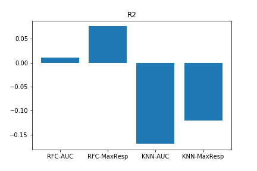<br><em>r2</em>
    </td>
    <td>
        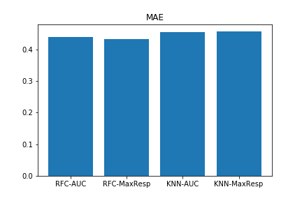<br><em>MAE</em>
    </td>        
    </tr>
    <tr>
    <td>
        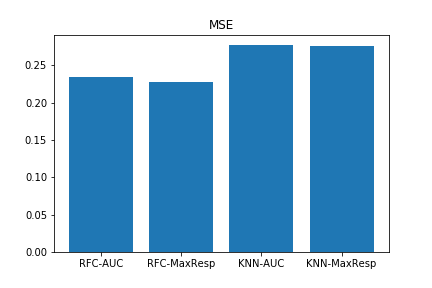<br><em>MS</em>
    </td>
    <td>
        <br> <em>expl var</em>
    </td>
    </tr>
    </table>

__classification__  
>Lorem ipsum dolor sit amet, consectetur adipiscing elit, sed do eiusmod tempor incididunt ut labore et dolore magna aliqua.

   ```python

   for whatever in whichever
        print("maybe code?")
   ```

<table>
    <tr>
    <td>
        
    </td>
    <td>
        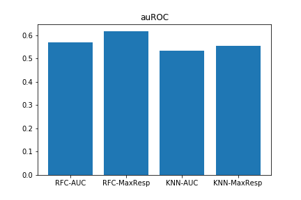
    </td>        
    </tr>
    <tr>
    <td>
        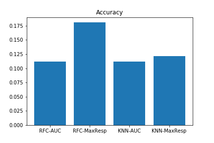
    </td>
    <td>
        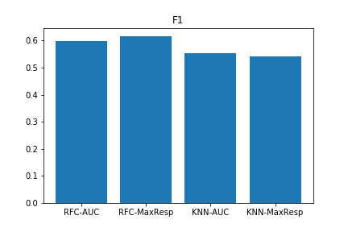
    </td>
    </tr>


</table>

__RFC AUC feature importance__
>something something

<table allign="center">
    <tr>
    <td>
        <br><em>r2</em>
    </td>
    </tr>
    </table>

__decision trees__
```python
def whatever(lst):
    return something
```

>Lorem ipsum dolor sit amet, consectetur adipiscing elit, sed do eiusmod tempor incididunt ut labore et dolore magna aliqua.

<table>
<tr>
    <td>
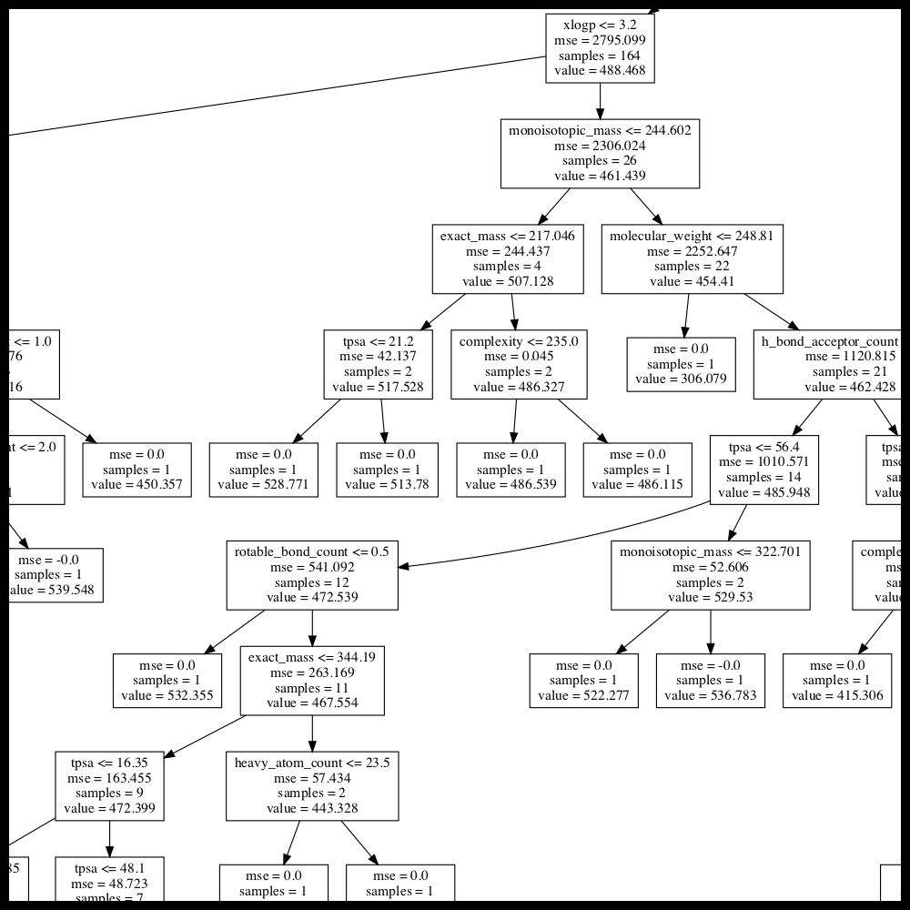
<details>
  <summary>Expand to View Full Size! (warning: v big)</summary>
  

 
</details>

</td>

<td>
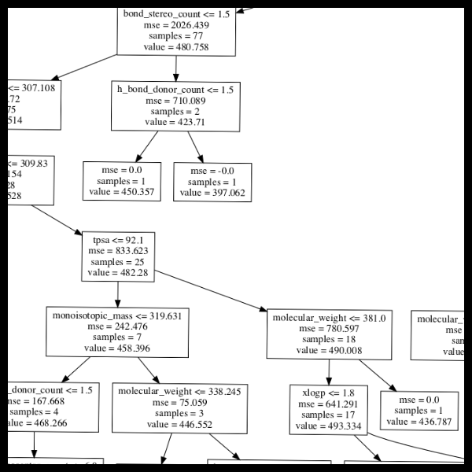
<details>
  <summary>Expand to View Full Size! (warning: v big)</summary>
  

 
</details>
</td>
</tr>

<tr>
<td>
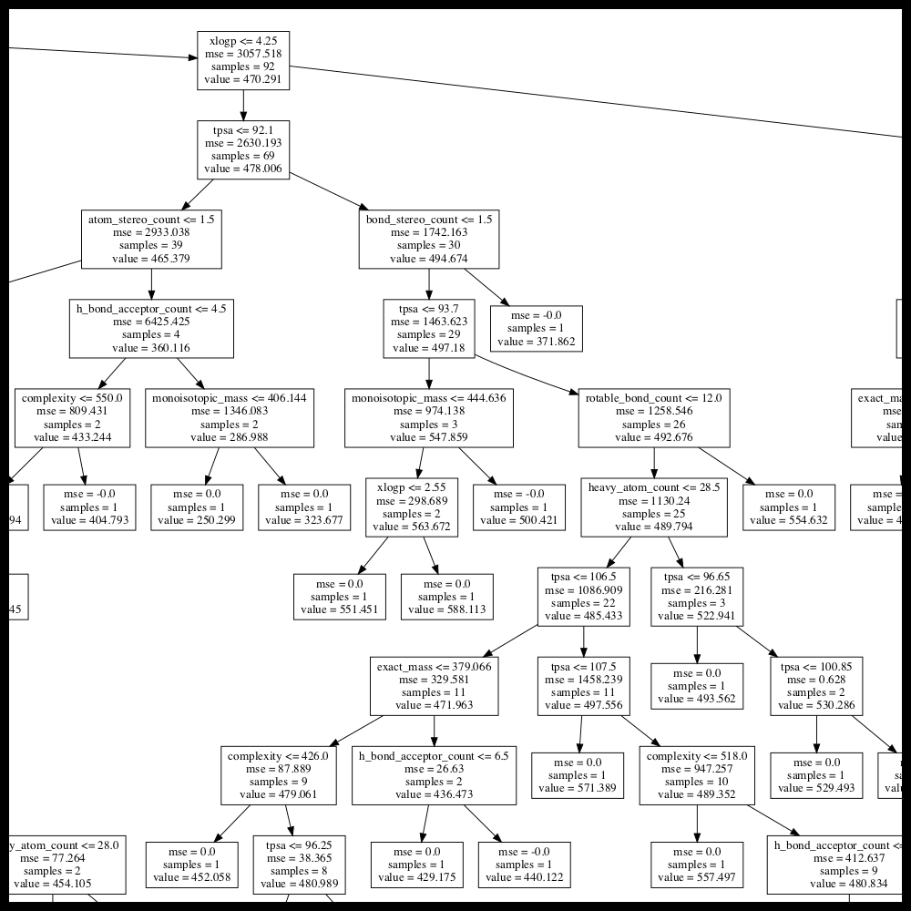
<details>
  <summary>Expand to View Full Size! (warning: v big)</summary>
  
 
</details>
</td>

<td>


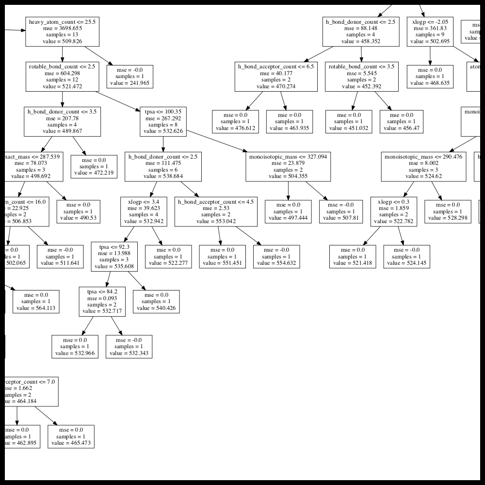
<details>
  <summary>Expand to View Full Size! (warning: v big)</summary>
  

 
</details>
</td>
</tr>
</table>
<a href="./static/images/tree5.png">look</a>
<a href="./static/images/tree6.png">at</a>
<a href="./static/images/tree7.png">more</a>
<a href="./static/images/tree8.png">trees</a>
<br><br>

__MLP__
>mlp explanation
```python
def whatever(lst):
    return something
```

<table>
<tr>
<td>
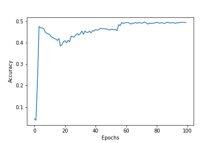<br><em>MLP accuracy vs epochs</em>
</td>
<td>
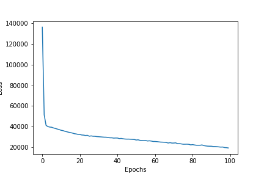<br><em>MLP loss     vs epochs</em>
</td>
<td>
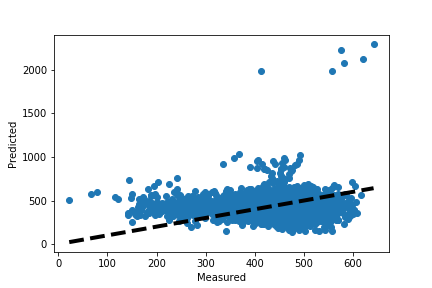<br><em>MLP measured vs predicted</em>
</td>

</tr>
</table>


__AUC STUFF__
>this is an explanation about all of this
```python
def whatever(lst):
    return something
```

<table>
<tr>
<td>

</td>
<td>

</td>
<td>
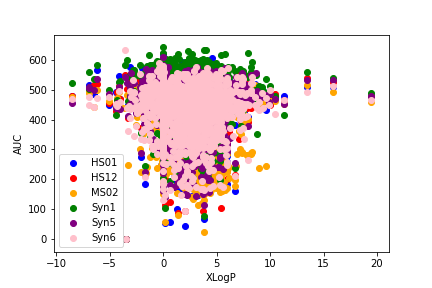
</td>
</tr>
</table>
`

##### 4. Correlate the gene targets of drugs with their relevance in RNA-seq and WGS data 
>`Excepteur sint occaecat cupidatat non proident, sunt in culpa qui officia `

## Results *: What did we observe? Figures are great!*

## Conclusion/Discussion: 

### Please make sure you address ALL of the following:

#### *1. What additional data would you like to have*

#### *2. What are the next rational steps?* 

#### *3. What additional tools or pipelines will be needed for those steps?*

#### *4. What skills would additional collaborators ideally have?*

## Reproduction: *How to reproduce the findings!*

### Docker

*The Docker image contains <R/jupyter> notebooks of all analyses and the dependencies to run them. *Be sure to note if you need any special credentials to access data for these analyses, **don't package restricted data** in your containers!*

Instructions for running the following notebooks: *be sure to adjust these instructions as necessary! check out https://github.com/Sage-Bionetworks/nf-hackathon-2019 for example containers and instructions*

1. `docker pull <your dockerhub repo>/<this container>` command to pull the image from the DockerHub
2. `docker run <your dockerhub repo>/<this container>` Run the docker image from the master shell script

### Important Resources *: primary data, github repository, Synapse project, dockerfile link etc.*


---
## members


<table>
<tr>
<td>
<a href="https://github.com/jackievaleri"></a>
</td>

<td>
    <a href="https://github.com/0916kj"></a>
</td>

<td>
<a href="https://github.com/jzwlin"> </a> 
</td>

<td>
<a href="https://github.com/cchristina">  </a>
</td>

<td>
<a href=""> </a>
</td>

<td><a href="https://github.com/JoeBVirtual"></a>


</tr>

<tr>
<td>
<a href="https://github.com/jackievaleri">
@jackievaleri
</a>
</td>

<td>
<a href="https://github.com/0916kj">
@0916kj
</a>
</td>

<td>
<a href="https://github.com/jzwlin">
@jzwlin  
</a>
</td>

<td>
<a href="https://github.com/cchristina">
@cchristina
</a>
</td>

<td>
<a href="https://github.com/AAR0NM">
@AAR0NM 
</a>
</td>


<td>
<a href="https://github.com/JoeBVirtual">
@JoeBVirtual
</a>
</td>

</tr>

<tr>
<td>
Jackie Valeri
</td>
<td>
Kate James
</td>
<td>
Wanlin Zheng
</td>

<td>
Christina Cuneo
</td>

<td>
Aaron M
</td>

<td>
Joe B Virtual

</td>

</tr>


</table>


---

<!-- ##   What is Neurofibromatosis? 

Neurofibromatosis is a set of three genetic conditions that cause tumors to grow throughout the body. It is automsomal dominant, though about half of all cases occur due to a random mutation.

__NF1__  
* Occurrs in about 1:3000 births  
    * most common genetic predisposition to neurological problems  
* Commonly diagnosed in early childhood or infancy   
* Characteristics (from CTF.org)
    * café-au-lait spots
    * neurofibromas (cutaneous, subcutaneous, plexiform)
    * scoliosis
    * learning disabilities and cognitive differences
    * larger head circumference
    * delayed or early puberty
    * shorter than average
    * optic gliomas
    * bone deformaties
    * cosmetic concerns
    * high blood pressure  
* The affects on an individual can vary wildly, even amongst identical twins! 


__NF2__  
* (info also from ctf.org)
* about 1:25000 worldwide
* characterized by the growth of vestibular schwannomas on the nerve that connects sound and balance information between the ears and bran
* common signs/symptoms
    * tinnitus
    * hearing loss
    * balance issues
    * facial weakness
    * brain and cranial nerve damage
    * swallowing difficulties
    * seizures
    * vision loss
    * balance and mobilitoy loss 


__Schwannomatosis__ (sp?)  
(all from ctf again)
* about 1:40000
* only recently identified
* characterized by the development of schwannomas, usually on spinal and peripheral nerves
    * schwannomas are abnormal growth of Schwann cells which are insulators to nerves (?????)
* common signs
    * numbness, tingling
    * weakness, including favial weakness
    * bowel and urinary dysfunction
    * vision changes
    * headaches 

---

## About the drug study

**this is directly from the page, not in my own words at all**  
To generate this data, we combined compound/drug screens from multiple different projects, representative of about 1.3 million compound-concentration-cell line combinations (some of which are combination experiments, where a mixture of 2 compounds are tested). We then ran these data through a common pipeline to generate summary statistics for each compound-cell line experiment. -->


<!-- ## tech stack

--- -->

## Tools et cetera
<table>
<tr>
<td>

</td>
<td>

</td>
<td>

</td>

<td>

</td>
</tr>
<tr>
<td>

</td>

<tr>

</table>


## Acknowledgements

#
Huge thank you to CTF, Sage,  SVAI, NTAP, uuhhh, google launchpad?

<table>
<tr>
<td>

</td>
<td>

</td>
<td>

</td>
<td>
|
</td>
</tr>
<td>

</td>
<td>

</td>
<td>

</td>
<td>

</td>
</tr>

</table>


---
other thigns?
requirements 
install/run instructions (make sure all extra files are in the repo et cetera)

talk about the NF Hackathon
